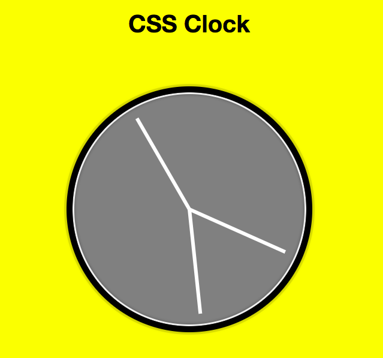

# JS + CSS AnalogClock

A page that displays a simple analog clock showing hour, minute & second hands using JS + CSS

Self-notes:
- used CSS property transform
- inbuilt function setInterval()
- JS called after HTML & CSS is loaded in <script>
- can also call JS in header but need to call the JS function in addEventListener("DOMContentLoaded") to make sure it loads after DOM
